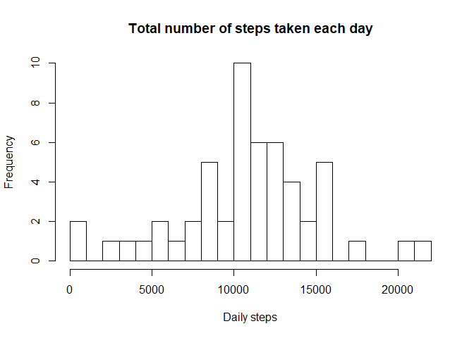
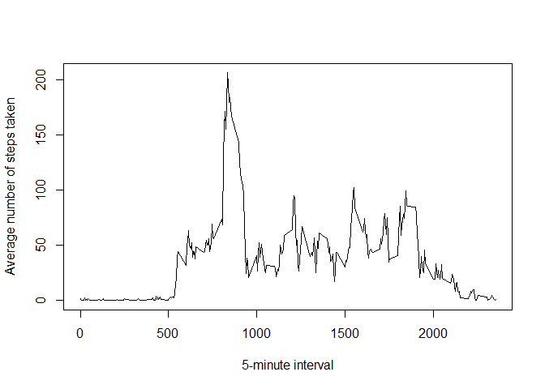
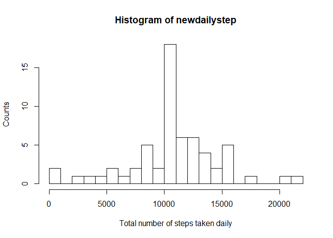
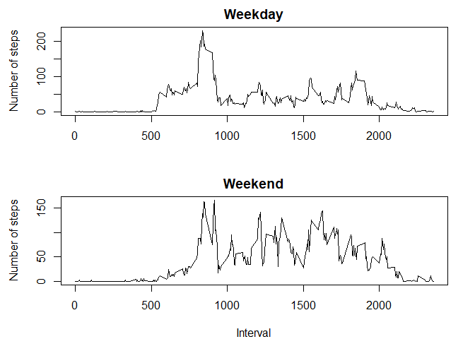

## Loading and preprocessing the data

```r
setwd("~/R.Studio/Reproducible_research/RepData_PeerAssessment1")
unzip("activity.zip")
activity <- read.csv("activity.csv")
```

## What is mean total number of steps taken per day?

```r
dailysteps <- tapply(activity$steps, activity$date, sum)
hist(dailysteps, breaks = 20, xlab = "Daily steps", 
     main = "Total number of steps taken each day")
```

<!-- -->

```r
mean(dailysteps, na.rm = T)
```

```
## [1] 10766.19
```

```r
median(dailysteps, na.rm = T)
```

```
## [1] 10765
```

## What is the average daily activity pattern?

```r
good <- complete.cases(activity)
gooddata <- activity[good, ]
meansteps <- tapply(gooddata$steps, gooddata$interval, mean)
interval <- as.numeric(names(meansteps))
plot(x = interval, y = meansteps, type = "l", xlab = "5-minute interval", 
     ylab = "Average number of steps taken")
```

<!-- -->


```r
which.max(meansteps)
```

```
## 835 
## 104
```

```r
meansteps[104]
```

```
##      835 
## 206.1698
```
## Imputing missing values

```r
bad <- !complete.cases(activity)
sum(bad)
```

```
## [1] 2304
```


```r
meandata <- as.numeric(meansteps)
filldata <- cbind(interval, meandata)
colnames(filldata) <- c("interval","steps")
activity1 <- activity
for (i in 1: 17568) {
        if (is.na(activity[i,1])){
                activity1[i,1] <- filldata[interval == activity1[i, 3], 2]
        }
}
```


```r
newdailystep <- tapply(activity1$steps, activity1$date, sum)
hist(newdailystep, breaks = 20, xlab = "Total number of steps taken daily", 
     ylab = "Counts")
```

<!-- -->

```r
mean(newdailystep)
```

```
## [1] 10766.19
```

```r
median(newdailystep)
```

```
## [1] 10766.19
```
## Are there differences in activity patterns between weekdays and weekends?

```r
date1 <- as.Date(activity1$date)
weekday <- weekdays(date1)
weekdays <- weekday
for (i in 1:17568) {
        if (weekdays[i] == "Saturday" | weekdays[i] == "Sunday") {
                weekdays[i] <- "weekend"
        } else {
                weekdays[i] <- "weekday"
        }
}
activity2 <- cbind(activity1, weekdays)
```


```r
weekenddata <- subset(activity2, weekdays == "weekend")
weekdaydata <- subset(activity2, weekdays == "weekday")
weekdaymean <- tapply(weekdaydata$steps, weekdaydata$interval, mean)
weekendmean <- tapply(weekenddata$steps, weekenddata$interval, mean)
```


```r
par(mfrow = c(2,1), mar = c(4,4.5,2,2))
plot(interval, weekdaymean, type = "l", ylab = "Number of steps", 
     xlab = "", main = "Weekday")
plot(interval, weekendmean, type = "l", ylab = "Number of steps", 
     xlab = "Interval", main = "Weekend")
```

<!-- -->
